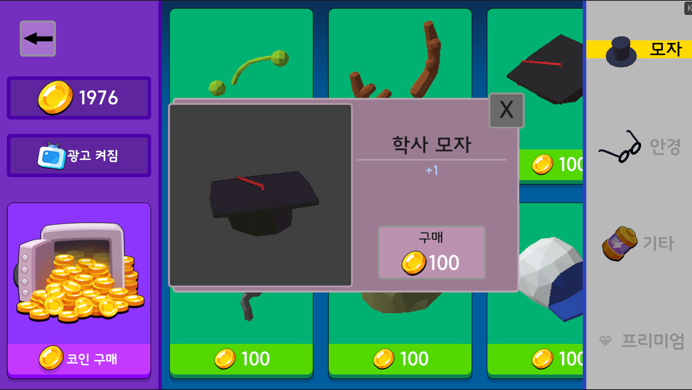

# Cubie Survivors

> 탑에서 끝없이 떨어지며 몰려오는 적을 처치하는 뱀서라이크 액션 게임

## 게임플레이

| | |
|---|---|
|  |  |
|  |  |
|  |  || 

---

## 개요

- **장르**: 뱀서라이크 액션
- **플랫폼**: Android
- **엔진**: Unity 6 (C#)
- **개발 기간**: 약 2년 (1인 개발)
- **특징**: 쿼터뷰 ↔ 3인칭 시점 전환, 보스 무기 획득 시스템
- **플레이 타임**: 한 판 약 10분 (30단계 + 보스 3종)

---

## 구현한 시스템

### 게임플레이
- **무기 획득 시스템**: 보스가 사용하는 무기를 처치 후 플레이어가 동일하게 사용 가능합니다. 무기 종류에 따라 보스 공격 패턴이 달라지며 패턴은 재사용 가능하도록 구현했습니다.
- **보스 예측 사격 AI**: 플레이어 이동 방향 예측샷, 반대 방향 예측샷, 현재 위치 직격을 정해진 확률로 결정합니다.
- **맵 생성**: 지형, 나무, 아이템 박스, 적 소환 위치를 확률적으로 생성합니다.
- **상황 반응형 아이템 드랍**: 체력이 낮으면 회복 아이템 확률 증가, 필드에 경험치가 많으면 자석 아이템 확률 증가

## 시스템
- **ScriptableObject 기반 데이터 관리**: 난이도, 스테이지, 아이템 정보를 SO로 분리
- **ScriptableObject 이벤트 버스**: EventChannelSO로 시스템 간 직접 참조 없이 이벤트 기반 통신 구현. 의존성 감소
- **PPR(Player Pressure Rate) 시스템**: 자체 설계한 적 위력 지표. 적 체력×이동속도로 플레이어 압박도를 수치화. 스테이지 생성 시 EnemySpawner 조합이 목표 PPR에 근접하도록 탐색 및 배치. 보스 무기 수와 업그레이드 횟수도 PPR로 환산해 적용.
- **난이도 곡선**: Normal/Hard/Hell 3단계. PPR이 난이도별 배율로 등비수열 증가. 반면 무기 위력은 등차수열 증가. 난이도가 점점 상승하다가 무기 획득으로 난이도 하락
- **공간 분할(Spatial Partitioning)**: 그리드 기반 버킷으로 근거리 적 탐색 최적화. 전체 탐색 대신 인접 버킷만 조회.
- **적 AI 상태 패턴**: 적 행동(공격, 이동, 넉백, 수면, 대쉬)을 상태 패턴으로 구현

### 오디오 / UI
- **음악 박자 연동 시스템**: 배경음 박자에 맞춰 적 소환 박스 이동 및 UI 하트 박동. 체력 50% 이하 박동수 증가
- **동적 조명 및 분위기 시스템**: 스테이지 진행에 따라 조명과 BGM 템포가 변화합니다.
- **아이템 선반 UI**: 일반적인 목록 UI 대신 3D 선반에 아이템을 진열하는 방식으로 구현했습니다.

### 최적화
- **일시정지 시 렌더링 최적화**: 업그레이드 선택 화면 진입 시 메인 카메라 렌더링 중단으로 GPU 쓰로틀링 방지
- **그래픽 퀄리티**: 저사양 기기 대응을 위한 퀄리티 레벨 분리
- **드로우 콜 최적화**: Dynamic Batching 적용. 배칭 조건 충족을 위해 인접 메시 통합 및 동일 메시 재사용으로 드로우 콜 수 감소
  

- **체력바 렌더링 최적화**: UI 대신 Quad 메시와 텍스처 UV 이동으로 체력바 구현해 드로우 콜 감소
- **Canvas 렌더링 최적화**: 업데이트 빈도에 따라 Canvas를 분리해 불필요한 Canvas 재렌더링 방지
- **제네릭 오브젝트 풀링**: 타입에 관계없이 재사용 가능한 제네릭 풀링 클래스 직접 설계

## 기술 스택

`Unity 6` `C#` `FMOD` `Android`
