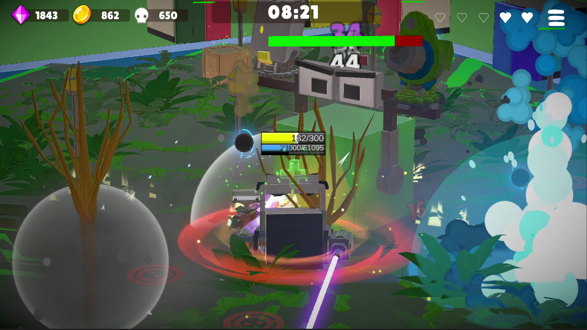

# Cubie Survivors

> 탑에서 끝없이 떨어지며 몰려오는 적을 처치하는 뱀서라이크 액션 게임

## 스크린샷

| | |
|---|---|
|  |  |
|  |  |
|  |  |
|  |  || 

---

## 개요

- **장르**: 뱀서라이크 액션
- **플랫폼**: Android
- **엔진**: Unity 6 (C#)
- **개발 기간**: 약 2년 (1인 개발)
- **특징**: 쿼터뷰 ↔ 3인칭 시점 전환, 보스 무기 획득 시스템

---

## 직접 구현한 시스템

### 게임플레이
- **보스 무기 획득 시스템**: 보스가 사용하는 무기를 처치 후 플레이어가 동일하게 사용 가능. 무기 종류에 따라 보스 공격 패턴이 달라지며 패턴은 재사용 가능하도록 설계
- **보스 예측 사격 AI**: 플레이어 이동 방향 예측샷, 반대 방향 예측샷, 현재 위치 직격을 정해진 확률로 수행. 즉발 무기는 플레이어의 과거 위치로 공격
- **단일 씬 구조**: 씬 전환 없이 seamless한 플레이 경험을 위해 모든 스테이지를 단일 씬에서 처리. 오브젝트 풀링으로 메모리 누수 방지
- **캐릭터 시스템**: 4종 캐릭터, 각각 고유 액티브 스킬 보유 (점프 /순간이동 / 대쉬&흡혈 등)
- **절차적 맵 생성**: 지형, 나무, 아이템 박스, 적 소환 위치를 조합해 지루함을 줄임.
- **환경 상호작용**: 번개, 폭발 → flammable 오브젝트 점화, 빔으로 나무 베기, 액체에 닿으면 느려지고 걸쭉한 지형에서는 더 느려짐, 얼음 위에서 미끄러짐

### 시스템 설계
- **제네릭 오브젝트 풀링**: 타입에 관계없이 재사용 가능한 제네릭 풀링 클래스 직접 설계
- **ScriptableObject 기반 데이터 관리**: 난이도, 스테이지, 아이템 정보를 SO로 분리
- **ScriptableObject 이벤트 버스**: EventChannelSO로 시스템 간 직접 참조 없이 이벤트 기반 통신 구현. 의존성 감소
- **세이브 시스템**: 캐릭터 언락, 영구 스탯, 아이템 장착 상태 등 게임 진행 상황 저장. 세이브 파일 암호화로 보안 처리
- **적 AI 상태 패턴**: 적 행동(공격, 이동, 넉백, 수면, 대쉬)을 상태 패턴으로 구현

### 오디오 / UI
- **음악 박자 연동 시스템**: 배경음 박자에 맞춰 적 소환 박스 이동 및 UI 하트 박동. 체력 50% 이하 박동수 증가
- **UIToolkit 기반 UI**: UGUI 대신 UIToolkit(UIElements) 사용. 웹 스타일의 USS/UXML로 UI 구성
- **그래픽 퀄리티 분리**: 저사양 기기 대응을 위한 퀄리티 레벨 분리

### 모바일 최적화
- **일시정지 시 렌더링 최적화**: 업그레이드 선택 화면 진입 시 메인 카메라 렌더링 중단으로 GPU 쓰로틀링 방지
- **저사양 기기 호환**: 구형 기기에서도 동작하도록 최적화

---

## 아쉬운 점 / 개선하고 싶은 것

- **Enemy 클래스 설계**: 베이스 클래스에 virtual 메서드를 몰아넣은 구조로 ISP(인터페이스 분리 원칙) 위반. `IAttackable`, `IMovable` 등 인터페이스로 분리하는 것이 나았을 것
- **맵 이동 구현**: 캐릭터 낙하 대신 맵 상승 방식으로 구현했는데, 중력 시스템을 건드리는 것이 더 나은 선택이었을 것
- **VFX 렌더링 버그**: 릴리즈 빌드에서 일부 VFX가 GPU 아키텍처별 셰이더 호환 문제로 미출력. 원인은 파악했으나 서드파티 에셋 의존성으로 수정 보류 중
- **유저의 플레이에 반응하는 Boss AI**: 확률적으로 행동하는 것을 넘어, 플레이어의 선택의 빈도가 반영되는 AI 시스템이면 더 특별한 경험을 줄 수 있을 것.
---

## 기술 스택

`Unity 6` `C#` `FMOD` `Android`
