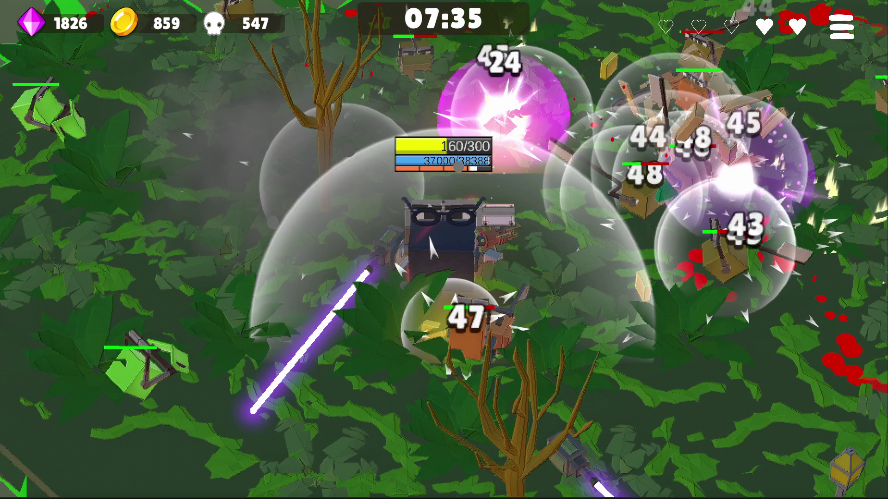
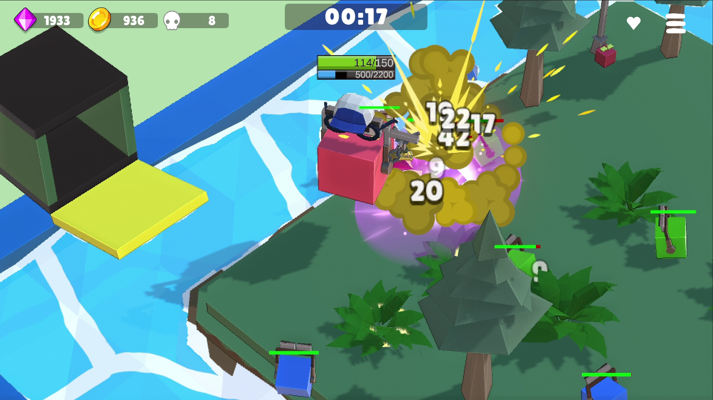
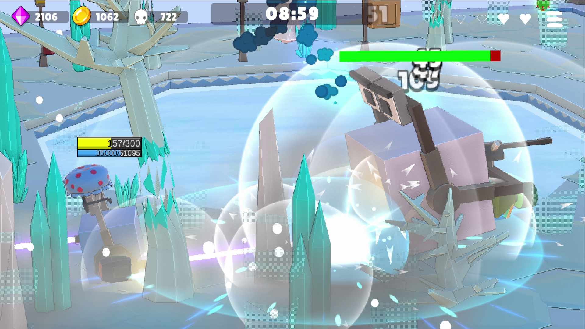
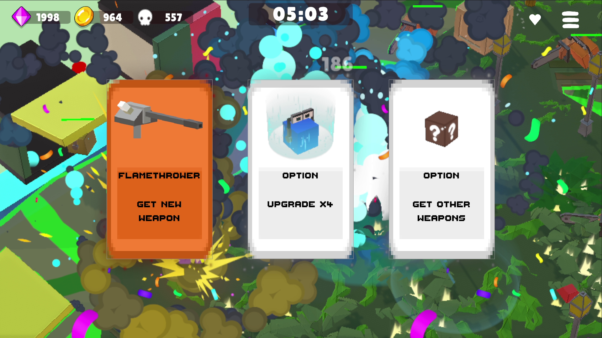
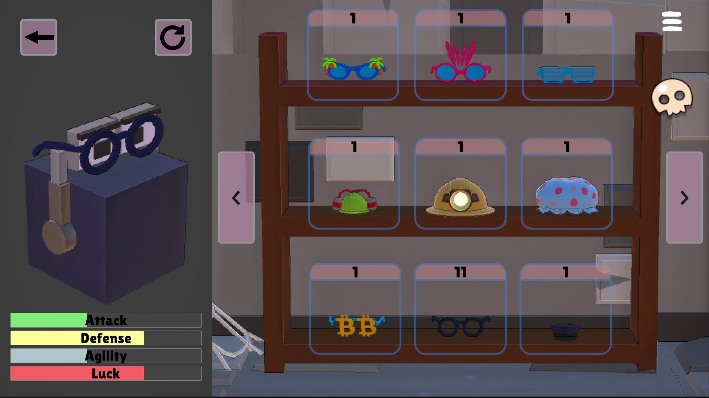
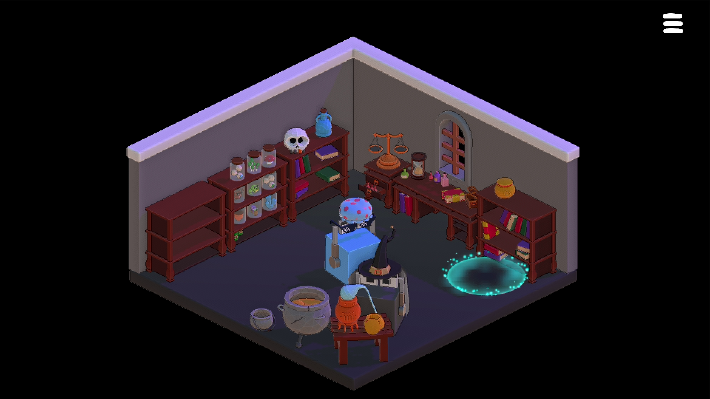
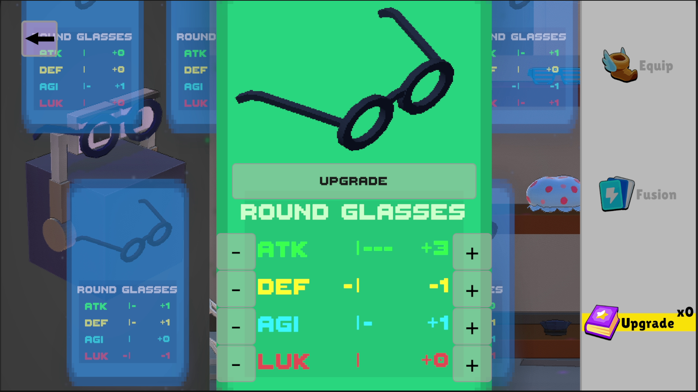

# Cubie Survivors

> 탑에서 끝없이 떨어지며 몰려오는 적을 처치하는 뱀서라이크 액션 게임

## 스크린샷

| | |
|---|---|
|  |  |
|  |  |
|  |  |
|  |  || 

---

## 개요

- **장르**: 뱀서라이크 액션
- **플랫폼**: Android
- **엔진**: Unity 6 (C#)
- **개발 기간**: 약 2년 (1인 개발)
- **특징**: 쿼터뷰 ↔ 3인칭 시점 전환, 보스 무기 획득 시스템
- **플레이 타임**: 한 판 약 10분 (30단계 + 보스 3종)

---

## 직접 구현한 시스템

### 게임플레이
- **보스 무기 획득 시스템**: 보스가 사용하는 무기를 처치 후 플레이어가 동일하게 사용 가능. 무기 종류에 따라 보스 공격 패턴이 달라지며 패턴은 재사용 가능하도록 설계
- **보스 예측 사격 AI**: 플레이어 이동 방향 예측샷, 반대 방향 예측샷, 현재 위치 직격을 정해진 확률로 수행. 즉발 무기는 플레이어의 과거 위치로 공격
- **단일 씬 구조**: 씬 전환 없이 seamless한 플레이 경험을 위해 모든 스테이지를 단일 씬에서 처리. 오브젝트 풀링으로 메모리 누수 방지
- **캐릭터 시스템**: 4종 캐릭터, 각각 고유 액티브 스킬 보유 (점프 /순간이동 / 대쉬&흡혈 등)
- **절차적 맵 생성**: 지형, 나무, 아이템 박스, 적 소환 위치를 조합해 지루함을 줄임.
- **환경 상호작용**: 번개, 폭발 → flammable 오브젝트 점화, 빔으로 나무 베기, 액체에 닿으면 느려지고 걸쭉한 지형에서는 더 느려짐, 얼음 위에서 미끄러짐
- **상황 반응형 아이템 드랍**: 체력이 낮으면 회복 아이템 확률 증가, 필드에 경험치가 많으면 자석 아이템 확률 증가

### 시스템 설계
- **무기 시스템**: 플레이어와 적이 동일한 무기를 사용하는 공용 설계. Melee/Ranged/Top/Magic/Hammer/Shield 6종 타입. 무기별 3~5가지 업그레이드 항목과 궁극 업그레이드 보유. 보스 처치 또는 초기 상자 획득으로 무기 습득
- **ScriptableObject 기반 데이터 관리**: 난이도, 스테이지, 아이템 정보를 SO로 분리
- **ScriptableObject 이벤트 버스**: EventChannelSO로 시스템 간 직접 참조 없이 이벤트 기반 통신 구현. 의존성 감소
- **PPR(Player Pressure Rate) 시스템**: 자체 설계한 난이도 지표. 적 체력×이동속도로 플레이어 압박도를 수치화. 스테이지 생성 시 EnemySpawner 조합이 목표 PPR에 근접하도록 탐색 및 배치. 보스 무기 수와 업그레이드 횟수도 PPR로 환산해 적용
- **난이도 시스템**: Normal/Hard/Hell 3단계. PPR이 난이도별 배율로 등비수열 증가. 초기엔 50레벨(업그레이드 횟수) 1사이클로 설계했으나 콘텐츠 볼륨과 성능 한계를 고려해 30단계로 조정
- **공간 분할(Spatial Partitioning)**: 그리드 기반 버킷으로 근거리 적 탐색 최적화. 전체 탐색 대신 인접 버킷만 조회
- **세이브 시스템**: 캐릭터 언락, 영구 스탯, 아이템 장착 상태 등 게임 진행 상황 저장. 세이브 파일 암호화로 보안 처리
- **적 AI 상태 패턴**: 적 행동(공격, 이동, 넉백, 수면, 대쉬)을 상태 패턴으로 구현

### 오디오 / UI
- **음악 박자 연동 시스템**: 배경음 박자에 맞춰 적 소환 박스 이동 및 UI 하트 박동. 체력 50% 이하 박동수 증가
- **동적 조명 및 분위기 시스템**: 스테이지 진행에 따라 조명과 BGM 템포가 변화.
- **아이템 선반 UI**: 일반적인 목록 UI 대신 3D 선반에 아이템을 진열하는 방식으로 구현. 몰입감 증대를 목표함.

### 최적화
- **일시정지 시 렌더링 최적화**: 업그레이드 선택 화면 진입 시 메인 카메라 렌더링 중단으로 GPU 쓰로틀링 방지
- **그래픽 퀄리티 분리**: 저사양 기기 대응을 위한 퀄리티 레벨 분리
- **메모리 할당 최소화**: 반복 물리 연산에 NonAlloc API 활용, 폰트 아틀라스 최적화 등 GC 최소화
- **드로우 콜 최적화**: Dynamic Batching 적용. 배칭 조건 충족을 위해 인접 메시 통합 및 동일 메시 재사용으로 드로우 콜 수 감소
- **체력바 렌더링 최적화**: UI 대신 Quad 메시와 텍스처 UV 이동으로 체력바 구현해 드로우 콜 감소
- **Canvas 렌더링 최적화**: 업데이트 빈도에 따라 Canvas를 분리해 불필요한 Canvas 재렌더링 방지
- **제네릭 오브젝트 풀링**: 타입에 관계없이 재사용 가능한 제네릭 풀링 클래스 직접 설계

  오브젝트 풀링 적용 전후 CPU 프레임 점유율:

  | 대상 | 최적화 전 | 최적화 후 |
  |------|-----------|-----------|
  | StagePool.Get() | 1.3% | 0.1% |
  | EnemySpawnDeviceSetter.Set() | 12% | 8% |
  | MainStage.set_Size() | 17.8% | 9.3% |

## 회고

- **Enemy 클래스 설계**: 베이스 클래스에 virtual 메서드를 몰아넣은 구조로 ISP(인터페이스 분리 원칙) 위반. `IAttackable`, `IMovable` 등 인터페이스로 분리하는 것이 나았을 것
- **유저의 플레이에 반응하는 Boss AI**: 확률적으로 행동하는 것을 넘어, 플레이어의 선택의 빈도가 반영되는 AI 시스템이면 더 특별한 경험을 줄 수 있을 것.
- **테스트 코드 부재**: 유닛 테스트 없이 개발해 버그 재현에 어려움. 간헐적 버그를 잡기 위해 장시간 직접 플레이하며 녹화하는 방식으로 대응.
---

## 기술 스택

`Unity 6` `C#` `FMOD` `UI Toolkit` `Android`
